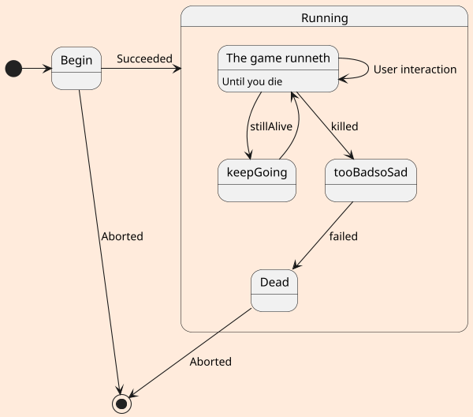
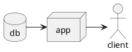

<!-- HEADDINGS -->
# Ejemplo de titulo h1
## Ejemplo de titilo h2
### Ejemplo de titulo h3
#### Ejemplo de titulo h4
##### Ejemplo de titulo h5
###### Ejemplo de titulo h6

___
## Ejemplo de formatos del texto
<!-- texto en cursiva -->
This is an *italic* text

This is an **strong** text

Texto en ***cursiva y negrita***

<!-- strikethrough -->
Esto es un ~~texto tachado~~

---
## Uso de listas
### Lista desordenada
* apple
    * red apple
    * Yellow apple
        * big Yellow apple
        * small yellow apple
            
* orange
* peach


### Lista ordenada
1. apple
    1. red apple
    2. Yellow apple
        1. big Yellow apple
        2. small yellow apple
2. orange
3. peach

___
## Enlaces de internet
### enlaces en la misma linea
<!-- Enlace sencillo -->
[faztweb.com](http://www.faztweb.com)
<!-- enlace cambiando la previsualizacion de la url por texto personalizado -->
[faztweb.com](http://www.faztweb.com "Custom title" )

### enlaces con la liga declarada aparte
[Logo de Markdown][mk1]

### enlaces con la liga declarada aparte y con titulo 
[Logo de Markdown](mk1 "Logo de markdown")

[mk1]:https://upload.wikimedia.org/wikipedia/commons/thumb/4/48/Markdown-mark.svg/1280px-Markdown-mark.svg.png
___
## ejemplo de citas 
<!-- citar textos  -->
> esta es una cita 

___
## Ejemplo de codigos
### Linea de codigo simple
<!-- Linea de codigo sensilla -->
`console.log('hello world')`

### Linea de codigo multiple, indicando el lenguaje
<!-- Multiples lineas de codigo con el lenguaje -->
<!-- La tilde (`) se saca con 96 -->
```python
for col in encode:
    dummy = pd.get_dummies(df[col], prefix=col)
    df = pd.concat([df,dummy], axis=1)
    del df[col]
```

```htnl
    <h1> Texto h1 de html<h1>
```
___
## Uso de tablas
<!-- tablas -->
<!-- el pipe (|) se saca con 124  -->
| nombre    |cantidad   |precio|
|-----------|:---------:|-----:|
|teclado    |15         |$600  |
|mouse      |10         |$200  |
|monitor    |3          |$1000 |
|laptop     |2          |$50000|

___
## Uso de Imagenes
### imagen de internet


### imagen en el equipo


<!-- REGLAS PROPIAS DE GITHUB MARCKDOWN -->
## Uso de todo lists
* [x] Task 1
* [x] Task 2
* [ ] Task 3
* [ ] Task 4
* [x] Task 5

## Uso de emojis y etiquetar personas 
@erasmo 👍 

[lista de emojis](https://gist.github.com/rxaviers/7360908)


___
## Uso de Diagramas tipo sirena


## uso de diagramas UML usando plantuml



## uso de diagramas con startuml

